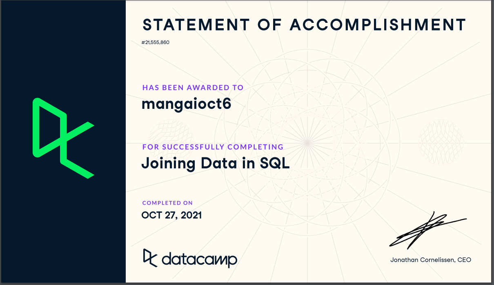

# SQL AUTOINCREMENTING
Databases are known to store a large amount of data in a logical format.It’s practically impossible to enter the numbers manually. So, instead, we can use Auto Increment in SQL. Auto-increment allows a unique number to be generated automatically when a new record is inserted into a table. Often this is the primary key field that we would like to be created automatically every time a new record is inserted.

To use the auto increment field, in PostgreSQL, we have to create an auto-increment field with the sequence object. The sequence object generates a number sequence.
### Serial datatype is an auto increment datatype in postgresql.
Syntax:

CREATE TABLE TableName (
Column1 DataType  SERIAL PRIMARY KEY,
Column2 DataType, 
);
#### FOR EXAMPLE:
Create a table with the name Customers, and columns CustomerID, CustomerName, Age and PhoneNumber. Auto-increment the CustomerID and make it the primary key for the table.

# SUBQUERY Vs JOIN

|                         SUBQUERY                                      |                       JOIN                          |                                                    
| -------------                                                         |                   -------------                     |
| * It can be used to return either a single value or a row             | * Joins are used to return rows                     |
| * we can select the columns from first table only.                    | * We can select the columns from either of the table|
| * Sometimes Works Slower than joins because of nested queries         | * In general joins work faster than sub-queries.    |   

  JOINS are used to retrieve data from multiple tables.JOIN is performed whenever two or more tables are listed in a SQL statement.An SQL subquery is a query inside another query. Subqueries, also known as nested queries.The main SQL query uses the result of the subquery.

   Both Subqueries and join are used to combine data from different tables into a single result. They share many similarities and differences. I would say, rather than going by theory, execution plan to see the performance of each option, and then make a decision.

# Screenshot

